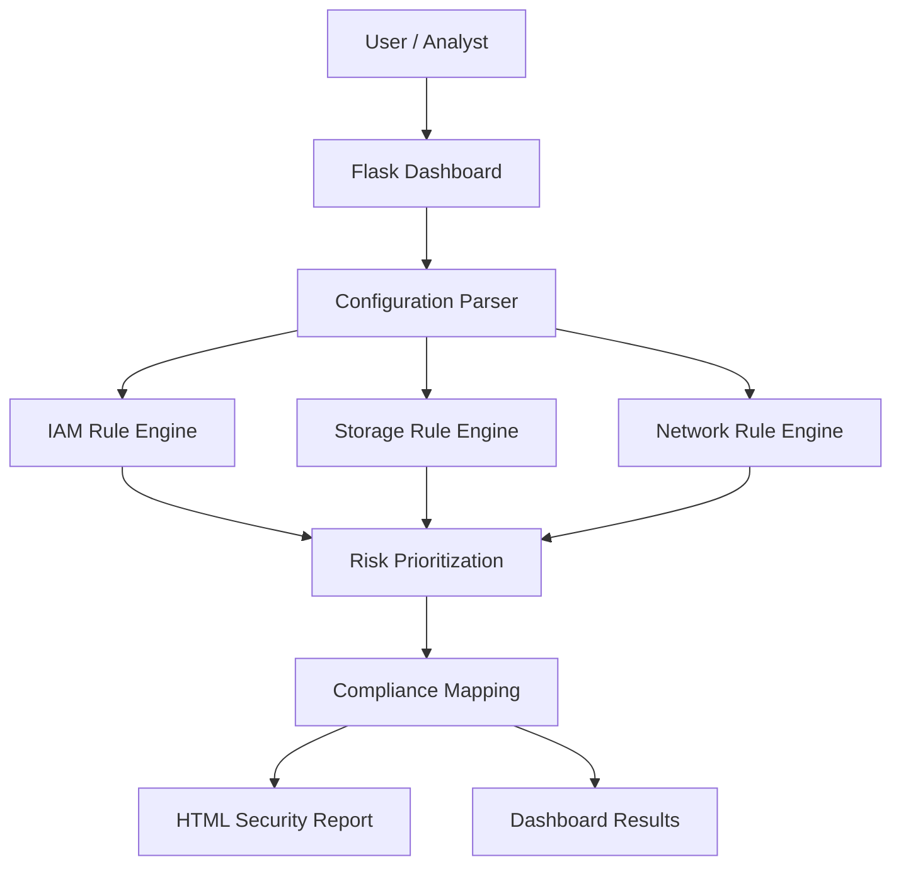

# ☁️ Cloud Misconfiguration Scanner – Cybersecurity Tool

## 📌 Overview
**Cloud Misconfiguration Scanner** is a Python-based cybersecurity tool designed to **identify, analyze, and prioritize cloud security misconfigurations** across Identity & Access Management (IAM), Storage, and Network components.

The project simulates how **cloud security engineers and SOC analysts** audit cloud environments to detect risks such as over-permissive IAM policies, publicly exposed storage, and insecure network rules.

Built using **Python and Flask**, this tool emphasizes **risk-based analysis**, **rule-engine design**, and **professional security reporting**, reflecting real-world cloud security workflows.

---

## 🚀 Key Features

- 🔐 **IAM Misconfiguration Detection**  
  Identifies over-privileged IAM policies, wildcard permissions, and weak access controls that can lead to privilege escalation.

- 🗄️ **Storage Security Analysis**  
  Detects publicly accessible storage buckets, missing encryption at rest, and potential sensitive data exposure.

- 🌐 **Network Exposure Assessment**  
  Flags insecure network rules such as public SSH/RDP access and overly permissive security group configurations.

- ⚖️ **Risk-Based Prioritization**  
  Classifies findings into **Critical, High, Medium, and Low** severity based on security impact.

- 📄 **Professional Security Reporting**  
  Generates structured HTML security assessment reports suitable for audits and reviews.

- 🧩 **Modular Rule Engine**  
  Extensible rule-based architecture allowing easy addition of new security checks.

---

## 🛠️ Tech Stack

| Component | Technology |
|---------|------------|
| Language | Python 3.9+ |
| Backend | Flask |
| Rule Engine | Custom Python-based rules |
| Data Format | JSON |
| Reporting | HTML Report Generator |
| Architecture | Modular & Scalable |
| Platform | Cross-platform |

---

## 🏗️ Architecture Overview



> 🎯 Educational Purpose & Impact
> Cloud Misconfiguration Scanner is designed for learning and skill development, not as a live CSPM product.
>
> It helps users:
>
> - Understand Cloud Security Risks caused by configuration errors
> - Learn how security tools detect misconfigurations
> - Gain hands-on experience with rule-based security analysis
> - Understand real-world debugging challenges in security tooling
> - Practice secure-by-design thinking
>
> Ideal for:
>
> - Cybersecurity students
> - Cloud security engineer aspirants
> - SOC analysts (L1/L2)
> - DevSecOps beginners
> - Security-focused software developers

---

## ⚠️ Legal & Ethical Disclaimer

🔒 **IMPORTANT NOTICE:**
This project is intended STRICTLY FOR EDUCATIONAL AND DEMONSTRATION PURPOSES.

**✅ Permitted Uses:**

- Learning cloud security concepts
- Academic projects and demonstrations
- Personal skill development
- Security training and awareness

**❌ Prohibited Uses:**

- Scanning cloud environments without authorization
- Commercial deployment without modification
- Misuse against real systems

Users must ensure:

- Only authorized configurations are analyzed
- Compliance with organizational and legal policies
- Responsible and ethical usage

---

## 📋 Quick Start

**Prerequisites**

- Python 3.9 or higher
- Basic understanding of cloud security concepts
- Sample JSON configuration files

**Installation**

```bash
git clone https://github.com/Anandhan-2253/Cloud-Misconfiguration-Scanner.git
cd Cloud-Misconfiguration-Scanner
```

**Run the Application**

```bash
cd dashboard
python app.py
```

**Access the Dashboard**

Open: http://127.0.0.1:5000

Upload sample cloud configuration JSON files to initiate a scan.

---

## 📄 Output

- Risk-prioritized security findings
- Interactive dashboard results
- Downloadable HTML security assessment report

---

## 🛡️ Security Takeaways

This project demonstrates:

- The dangers of cloud misconfigurations
- Why least-privilege access is critical
- How public exposure increases attack surface
- The importance of structured security reporting
- How real security tools avoid silent false negatives

🔍 Secure the cloud by design, not by accident.

---

## 👤 Author

Anandhanarayan K
Cloud Security & Cybersecurity Enthusiast
India 🇮🇳

---

## 📜 License

This project is released for educational and non-commercial use only. Unauthorized commercial usage is prohibited.

---
